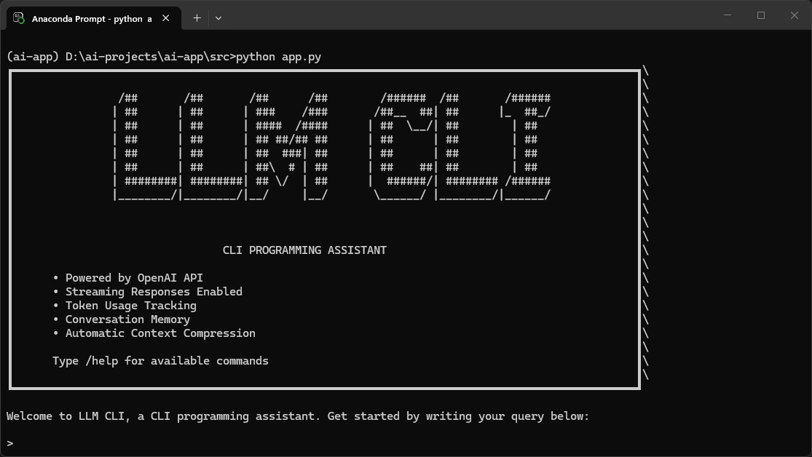
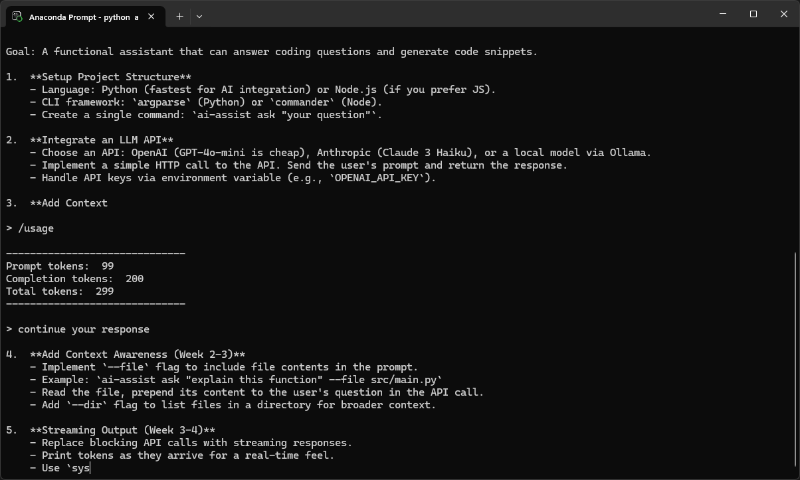
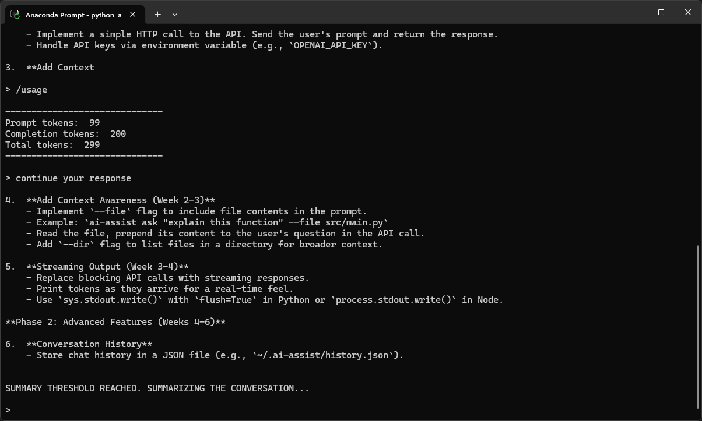
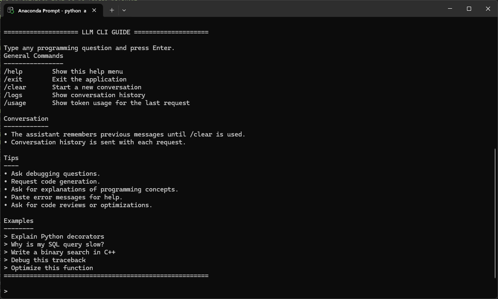
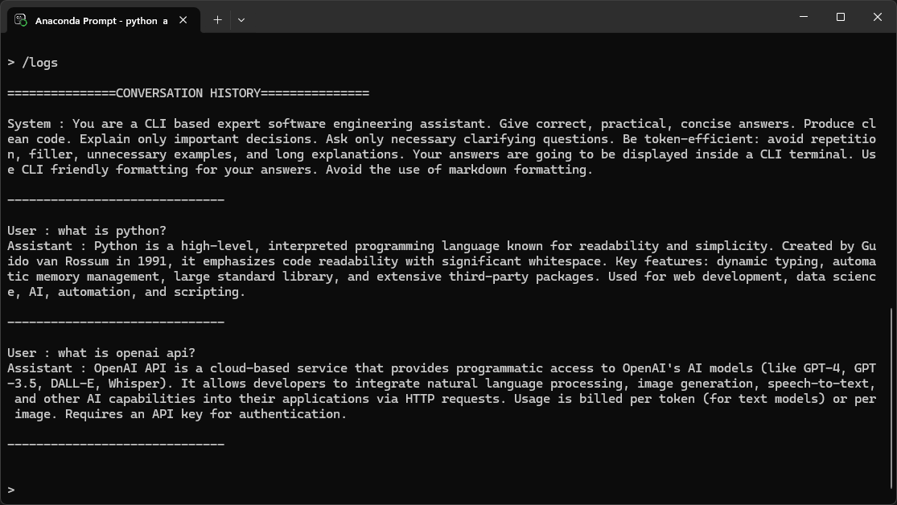
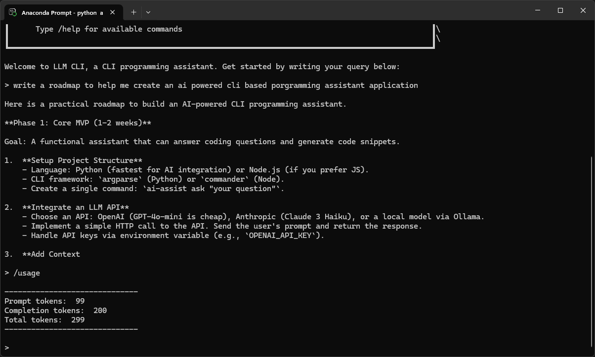

# LLM CLI Assistant

LLM CLI Assistant is a learning project that demonstrates the core building blocks of production LLM applications using the DeepSeek API and the OpenAI Python SDK. It implements streaming responses, conversation memory, automatic context summarization, token usage tracking, and a modular architecture while remaining lightweight enough to run entirely from the terminal.

---

## Features

- **Streaming Responses**: Real-time token-by-token output for a responsive and natural chat experience.
- **Conversation Memory**: Maintains context across multiple turns without needing to restate the problem.
- **Automatic Context Compression**: Intelligently summarizes older context when token limits are reached, ensuring you never run out of context window capacity while maintaining long-term memory.
- **Token Tracking**: Built-in commands to monitor your token usage and API efficiency.
- **Slash Commands**: Quick, intuitive commands to manage your session (e.g., clear history, view logs, check usage).
- **Graceful Error Handling**: Helpful feedback for missing configuration or unrecognized commands.
- **Modular Design**: Cleanly separated components for chat completion, command handling, and conversation summarization.

---

## Demo

Here's a look at the LLM CLI Assistant in action:

**Splash Screen & Getting Started**

*The clean, informative startup interface greeting you with essential information.*

**Basic Conversation**

*Asking programming questions directly in your terminal.*

**Streaming Responses**


*Responses are streamed back token-by-token, minimizing perceived latency.*

**Help Menu**

*Easily discoverable slash commands using `/help`.*

**Conversation Logs**

*Reviewing the full conversation history with the `/logs` command.*

**Token Usage**

*Keeping track of your API consumption with `/usage`.*

**Automatic Context Summarization**

*When conversations get too long, the assistant automatically summarizes older messages to preserve context and save tokens.*

**Session Management**

*Managing your session state using `/clear` to reset memory and `/exit` to close the app.*

**Robust Error Handling**


*Clear error messages for misconfigurations and invalid inputs.*

---

## How It Works

The CLI assistant is designed with efficiency and modularity in mind:

- **API Communication**: Uses the official `openai` Python SDK configured to communicate with the DeepSeek API (`api.deepseek.com`).
- **Conversation Memory**: A rolling list of message dictionaries is maintained in memory during the session, allowing the LLM to contextually understand follow-up questions.
- **Streaming**: The application requests a stream from the API and iteratively prints chunks to `stdout`, creating a responsive typewriter effect.
- **Token Tracking**: Takes advantage of `stream_options={"include_usage": True}` to capture exact prompt and completion token counts from the API.
- **Automatic Summarization**: Once the prompt token usage exceeds a defined threshold (2000 tokens), the `summarize.py` module triggers a secondary LLM call. It merges the oldest messages into a concise summary bullet list while retaining the most recent messages, seamlessly preventing context overflow. (Note: The threshold was reduced to 300 tokens for demonstration.)
- **Slash Commands**: A dedicated parser intercepts user inputs starting with `/`, bypassing the LLM to execute local functions like clearing the terminal or displaying logs.
- **Modular Design**: Code is split by domain—`chat.py` for API requests, `summarize.py` for memory management, `handle_commands.py` for CLI routing, and `config.py` for settings.

---

## Project Structure

```text
.
├── src/
│   ├── app.py                 # Main application entry point and chat loop
│   ├── chat.py                # Handles LLM API requests and streaming
│   ├── config.py              # Centralized configuration, constants, and prompts
│   ├── handle_commands.py     # Parses and executes user slash commands
│   ├── summarize.py           # Logic for automatic context compression
│   └── utils.py               # Helper functions for message formatting
├── images/                    # Screenshots used in documentation
├── notebooks/                 # Jupyter notebooks for experimentation
├── .env.example               # Example environment variables template
├── requirements.txt           # Python dependencies
└── README.md                  # Project documentation
```

---

## Installation

1. **Clone the repository**
   ```bash
   git clone https://github.com/S84v/cli-ai-assistant
   cd cli-ai-assistant
   ```

2. **Set up a virtual environment (optional but recommended)**
   ```bash
   python -m venv venv
   # On Windows:
   venv\Scripts\activate
   # On macOS/Linux:
   source venv/bin/activate
   ```

3. **Install dependencies**
   ```bash
   pip install -r requirements.txt
   ```

---

## Configuration

The application requires a valid DeepSeek API key to function. 

1. Copy the example environment file:
   ```bash
   # On Windows:
   copy .env.example .env
   # On macOS/Linux:
   cp .env.example .env
   ```

2. Open the `.env` file and insert your API key:
   ```env
   DEEPSEEK_API_KEY=your_api_key_here
   ```

---

## Usage

Start the assistant by running the main application script:

```bash
python src/app.py
```

Once running, simply type your programming questions at the `>` prompt.

### Slash Commands

The following commands can be typed directly into the prompt:

- `/help` - Show the help menu and usage tips.
- `/clear` - Clear the terminal and start a fresh conversation (wipes memory).
- `/logs` - Print the complete internal conversation history and summaries.
- `/usage` - Display token usage metrics for your most recent prompt.
- `/exit` - Close the application gracefully.

---

## Technologies Used

- **Python 3.8+**
- **[OpenAI Python SDK](https://github.com/openai/openai-python)** - For standardized, robust LLM API communication.
- **[python-dotenv](https://github.com/theskumar/python-dotenv)** - For managing secret environment variables securely.
- **[Pydantic](https://docs.pydantic.dev/)** - Data validation underneath the OpenAI SDK.

---

## Future Improvements

- **Multi-Model Support**: Allow switching between different models (e.g., fast models vs. reasoning models) via a slash command.
- **Markdown Rendering**: Render code blocks with syntax highlighting directly in the terminal.
- **Persistent Sessions**: Save conversation states to a local SQLite or JSON file to resume chats across application restarts.
- **File Ingestion**: Add commands to automatically inject local file contents into the context window.

---

## License

MIT License. See `LICENSE` for more information.
